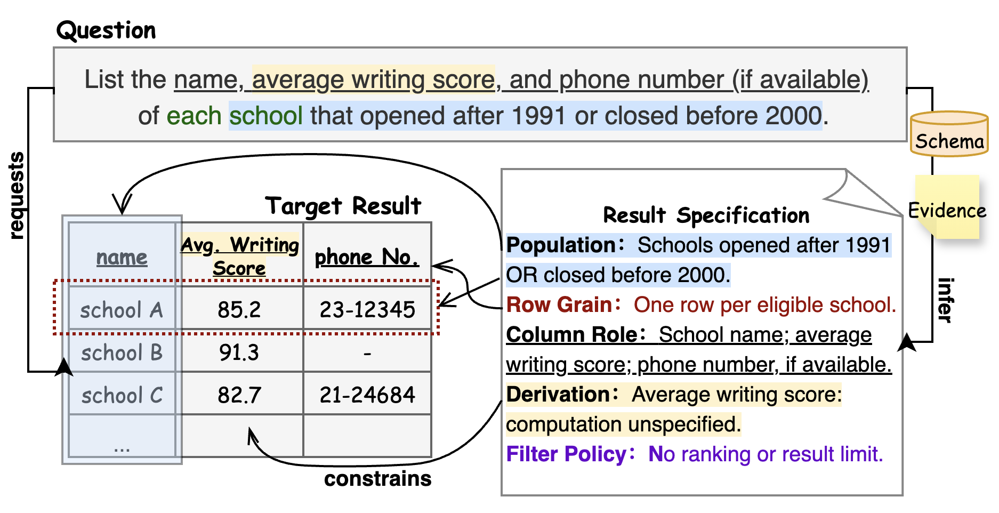

# Result Specifications for NL-to-SQL

A Result Specification (RS) describes the intended result table through five semantic dimensions: **Population, Row Grain, Column Role, Derivation, and Filter Policy**. It separates what a query should return from how that query is implemented in SQL.

This repository contains RS generation and schema filtering, prepared benchmark inputs, and integrations with **DeepEye-SQL, DAIL-SQL, and DIN-SQL**. The experiment scripts compare original and RS-assisted execution at **Schema Linking, Generation, Revision, and Selection**, where applicable to each method.

<p align="center">
  
</p>
<p align="center"><em>Figure 1. An example of Result Specification (RS).</em></p>

## Overview

RS makes result requirements explicit before SQL generation and provides a shared semantic reference for later reasoning and verification. Its constraints are inferred from the question, supplementary evidence, and database schema. Requirements left undetermined by this information remain unresolved; concrete SQL implementation choices are left to the NL-to-SQL method.

The repository supports three parts of this workflow:

- **RS construction:** infer an initial specification from the question and evidence, refine it using database metadata, and check it against gold SQL to construct the Oracle RS used in the supplied experiments.
- **Method integration:** use RS for schema filtering and stage-specific model guidance through the method adapters, while retaining each method's own execution workflow.
- **Evaluation:** compare original and RS-assisted outputs across five evaluation sets, using saved stage records, SQL execution comparisons, and schema-linking reference annotations.

The evaluation sets are **BIRD dev, Spider dev, Spider test, BIRD-Interact Lite, and BIRD-Interact Full**. Reusable inputs and reference annotations are included; database files, downloaded models, vector caches, and experiment results are kept separately.

## Repository Structure

```text
Result-Contract/
├── assets/
│   └── rs_example.png
├── data/
│   ├── bird_dev/
│   ├── spider_dev/
│   ├── spider_test/
│   ├── bird_interact_lite/
│   ├── bird_interact_full/
│   └── reference/
├── result_contract/
│   ├── data_preprocess/
│   └── rc/
├── scripts/
│   ├── preprocess.py
│   ├── generate_rc.py
│   ├── filter_meta.py
│   ├── baseline_adapters/
│   ├── rc_evaluation/
│   └── analysis/
├── baselines/
│   ├── DeepEye-SQL/
│   ├── DAIL-SQL/
│   └── DIN-SQL/
├── config/
│   ├── .env.example
│   ├── deepeye/
│   ├── dail_sql/
│   └── din_sql/
├── docs/
├── pyproject.toml
├── uv.lock
└── README.md
```

## Data

[`data/`](data/) contains the prepared inputs for the five evaluation sets, covering 5,320 questions. Each set includes:

- question records with database identifiers, questions, and evidence;
- full database metadata in `meta/` and saved RS-filtered metadata in `filtered_meta.json`;
- generated specifications in `rc.json`;
- reference SQL and dependency information, where available.

`data/reference/` contains the model-assisted schema-linking reference annotations and the provenance manifest for the saved filtered schemas. The saved filters retain unsuccessful records explicitly; full metadata remains available and is the default input to the method runners.

The bundled inputs can be used without repeating preprocessing. SQL execution still requires the corresponding databases. See [Data layout](docs/data.md) for file formats and [External resources](docs/dependencies.md) for database setup.

## Result Specification Generation

[`result_contract/`](result_contract/) contains the reusable Python implementation:

- `data_preprocess/` converts BIRD, Spider, and BIRD-Interact resources into the shared input format.
- `rc/` contains RS generation, schema filtering, and the generation prompts.

Generation proceeds from question and evidence (**Round 1**), through metadata refinement (**Round 2**), to correction using gold SQL (**Round 3**). The supplied experiment configurations use the resulting **Oracle RS**, stored in `rc_round3`. The command-line entrypoints are in `scripts/`; see [RS generation](docs/rs.md) for usage.

### Terminology

The implementation retains the earlier **Result Contract (RC)** naming in paths, functions, options, and data fields for compatibility. These identifiers refer to **Result Specification (RS)**: for example, `rc.json` stores RS records. Prompt templates retain their original wording for reproducibility. Use the identifiers in commands and configuration examples as written.

## Experiment Scripts

[`scripts/`](scripts/) connects data preparation, the three methods, and evaluation:

- `preprocess.py`, `generate_rc.py`, and `filter_meta.py` provide the preparation and RS-generation commands.
- `baseline_adapters/` handles method-specific inputs, prompts, model requests, and database execution.
- `rc_evaluation/` runs original/RS comparisons and manages resumable records, targeted reruns, and exports.
- `analysis/` computes stage-level summaries from saved records and evaluation results.

The methods retain their own execution workflows rather than sharing an identical pipeline. See [Experiments](docs/experiments.md) for preparation and execution commands, and [Evaluation](docs/evaluation.md) for SQL comparison and record handling.

## Baselines

[`baselines/`](baselines/) provides the upstream method code. **DeepEye-SQL** is included with the local sampling/runtime integration; **DAIL-SQL** and **DIN-SQL** are pinned Git submodules. The experiment adapters live separately under `scripts/baseline_adapters/`.

Initialize the submodules after cloning with `git submodule update --init --recursive`. See [Dependencies](docs/dependencies.md) for upstream links and method-specific resources. Third-party licenses are retained with their source; benchmark and model resources remain subject to their original terms.

## Configuration and Environment

[`config/`](config/) contains the model/database environment template and each method's dataset and experiment settings. The root `pyproject.toml` and `uv.lock` define the shared Python 3.12 environment.

After cloning and initializing the submodules, run from the repository root:

```bash
uv sync --locked
uv run python -m scripts.check_setup
cp config/.env.example config/.env
```

The setup check validates bundled inputs and dependencies without calling models or connecting to databases. Fill `config/.env`, set resource paths, and follow the method-specific preparation instructions before running an experiment. Start with a small scope and adjust concurrency to your service and database limits.

Local runtime files are ignored by Git: `resources/` holds downloaded tools and models, `cache/` holds reusable preparation, and `outputs/` holds run records and analyses.

## Documentation

[`docs/`](docs/) provides the detailed guides:

- [Data](docs/data.md): evaluation sets, input formats, and saved artifacts.
- [RS generation](docs/rs.md): generation rounds, schema filtering, and Python usage.
- [Dependencies](docs/dependencies.md): databases, model services, and retrieval resources.
- [Experiments](docs/experiments.md): preparation, execution, resuming, and reruns.
- [Evaluation](docs/evaluation.md): SQL matching, record versions, and result exports.
- [Analysis](docs/analysis.md): stage-level metrics and summary tables.
