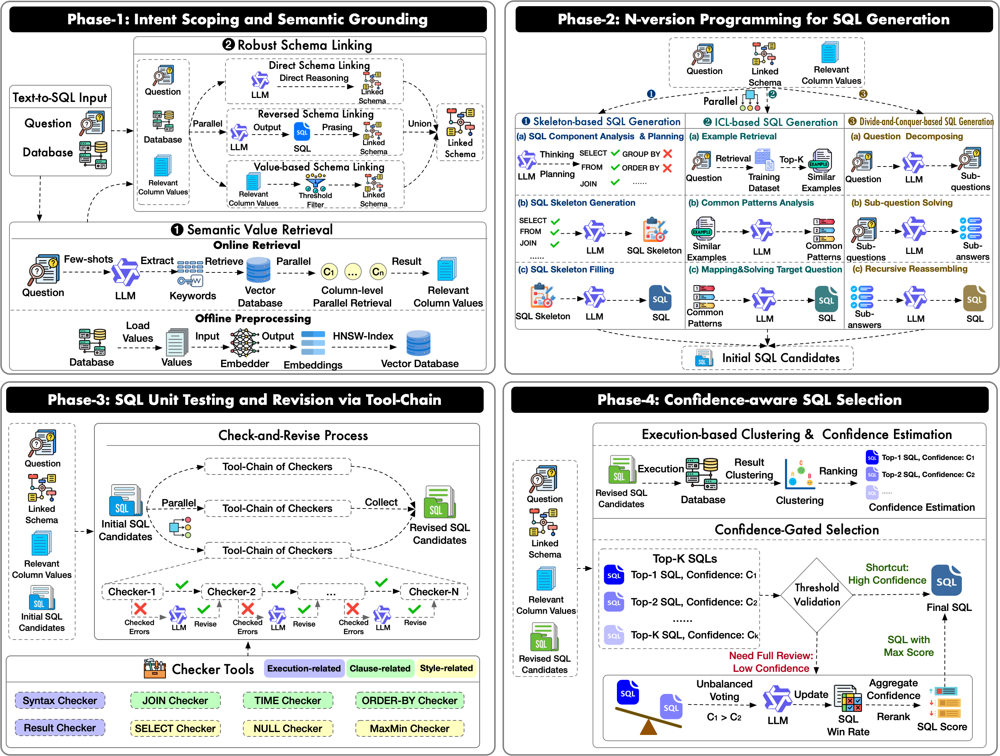

<div align="center">

<h1>DeepEye-SQL</h1>
<p><strong>SIGMOD 2026 · Software-Engineering-Inspired Text-to-SQL</strong></p>

<p>
  <a href="https://deepeyesql-hahwwmgj.manus.space"></a>
  <a href="https://doi.org/10.1145/3802035"></a>
  
  
  <a href="./LICENSE"></a>
</p>

<p>
  <a href="https://deepeyesql-hahwwmgj.manus.space">Homepage</a> ·
  <a href="https://doi.org/10.1145/3802035">Paper</a> ·
  <a href="#results">Results</a> ·
  <a href="#architecture">Architecture</a> ·
  <a href="#runbooks">Runbooks</a> ·
  <a href="#citation">Citation</a>
</p>

</div>

---

## Overview

DeepEye-SQL treats Text-to-SQL as a software engineering process rather than a single-shot generation task.
It decomposes the problem into grounding, schema linking, implementation, debugging, and final selection, then coordinates those stages with structured snapshots and execution-aware checks.

The repository contains the research pipeline used for our SIGMOD 2026 paper, with support for BIRD, Spider, and Spider2. From-scratch reproduction instructions live in the dataset-specific runbooks under [docs/](docs/README.md).

## Highlights

| Capability | What it provides |
| --- | --- |
| Software-engineering pipeline | A staged workflow for grounding, linking, generation, revision, and selection. |
| Dynamic few-shot retrieval | Automatic training-set indexing with LLM-based question/SQL masking and preliminary-SQL-guided retrieval. |
| Checker-based SQL revision | Syntax, execution, and result-level repair before final selection. |
| Execution-aware selection | Candidate SQLs are compared with database feedback instead of relying only on model preference. |
| Structured snapshots | Long-running experiments are resumable, inspectable, and exportable. |

## News

| Date | Update |
| --- | --- |
| **2026-07-10** | **Qwen3.6-27B achieves 78.4 EX on the BIRD test set.** |
| 2026-07-02 | Added dynamic few-shot retrieval, model-organized config templates, unified dataset wrappers, and public runbooks for BIRD, Spider, and Spider2. |

## Results

| Benchmark | Metric | Score | Model | Public Output |
| --- | --- | ---: | --- | --- |
| BIRD-Dev | EX | **74.5** | Qwen3.6-27B | [prediction JSON](results/bird-dev/qwen3.6-27b.json) |
| BIRD-Test | EX | **78.4** | Qwen3.6-27B | not released |
| Spider2-Lite | official score | **38.2** | DeepSeek-R1 | [outputs](results/spider2-lite/deepseek-r1) |
| Spider2-Snow | official score | **50.5** | DeepSeek-R1 | [outputs](results/spider2-snow/deepseek-r1) |

## Architecture

<p align="center">
  
</p>

## Runbooks

The root README is intentionally kept as a project overview. Use the runbooks for setup, config edits, dataset preparation, execution commands, inspection, export, and evaluation.

| Dataset | Runbook | Template families |
| --- | --- | --- |
| BIRD | [docs/bird.md](docs/bird.md) | `config/template/*/config-bird-dev.toml`, `config-bird-test.toml` |
| Spider | [docs/spider.md](docs/spider.md) | `config/template/*/config-spider-test.toml` |
| Spider2 | [docs/spider2.md](docs/spider2.md) | `config/template/*/config-spider2-lite.toml`, `config-spider2-snow.toml` |

Tracked config templates are grouped by model under [config/template](config/template/). Local experiment configs should be copied under `config/local/<model>/`, which is ignored by git.

## Repository Map

| Path | Purpose |
| --- | --- |
| [app/](app) | Core config, dataset, database, LLM, prompt, service, vector index, and pipeline code. |
| [app/few_shot/](app/few_shot) | Dynamic few-shot masking, indexing, retrieval, and runtime preparation. |
| [config/template/](config/template) | Public model-organized TOML templates. |
| [docs/](docs) | Dataset-specific runbooks for fresh-checkout reproduction. |
| [runner/](runner) | Python entry points for individual stages, export, inspection, and evaluation. |
| [script/](script) | Shell wrappers for dataset-level runs. |
| [results/](results) | Released predictions and benchmark outputs. |
| `workspace/` | Generated local snapshots and intermediate outputs. Ignored by git. |

## Citation

If you find DeepEye-SQL useful in your research, please cite:

Paper: [https://doi.org/10.1145/3802035](https://doi.org/10.1145/3802035)

```bibtex
@article{10.1145/3802035,
author = {Li, Boyan and Chen, Chong and Xue, Zhujun and Mei, Yinan and Luo, Yuyu},
title = {DeepEye-SQL: A Software-Engineering-Inspired Text-to-SQL Framework},
year = {2026},
issue_date = {June 2026},
publisher = {Association for Computing Machinery},
address = {New York, NY, USA},
volume = {4},
number = {3},
url = {https://doi.org/10.1145/3802035},
doi = {10.1145/3802035},
journal = {Proc. ACM Manag. Data},
month = may,
articleno = {158},
numpages = {28},
keywords = {text-to-sql, databases, large language models}
}
```

## License

This project is released under the MIT License. See [LICENSE](LICENSE).

## Acknowledgement

DeepEye-SQL builds on public benchmark ecosystems and OpenAI-compatible LLM serving stacks. We thank the maintainers of Spider, BIRD, Spider2, ChromaDB, OpenAI-compatible serving frameworks, and the broader Text-to-SQL research community.
